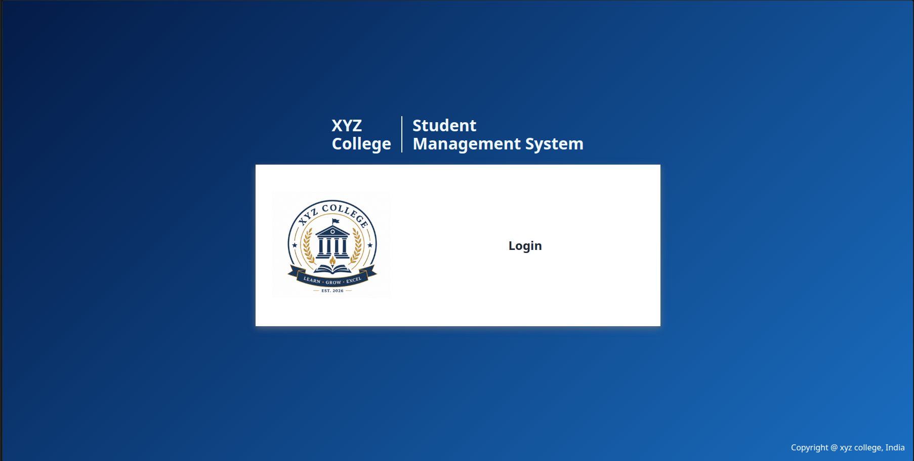
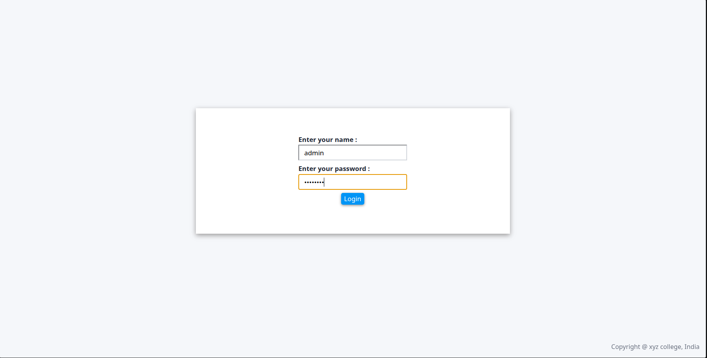
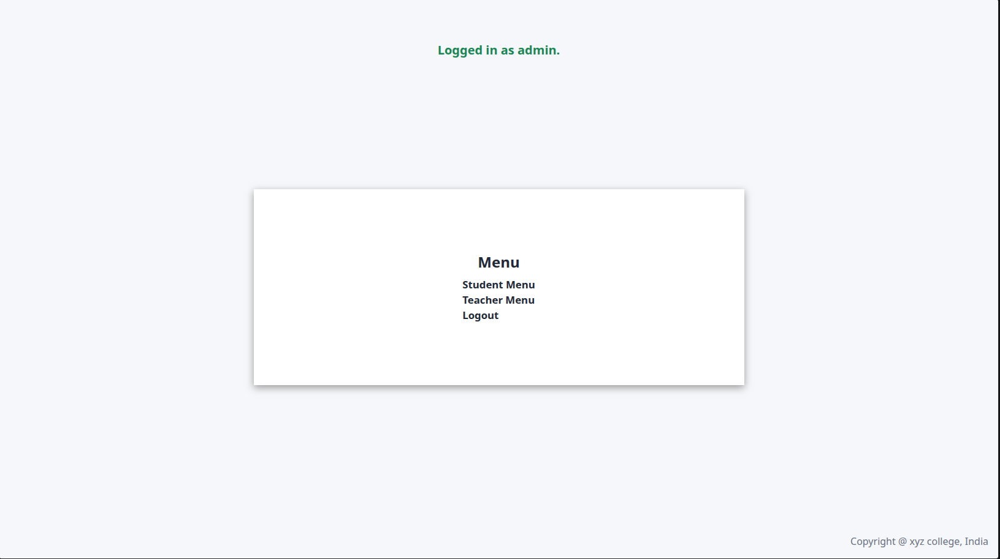
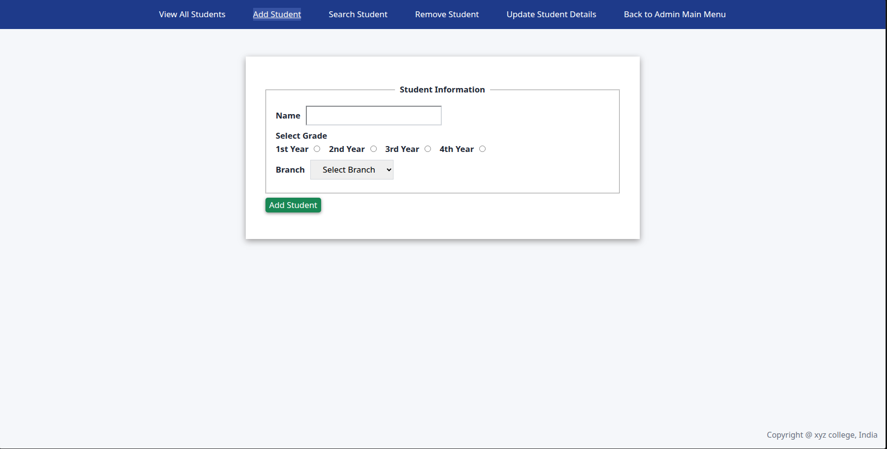
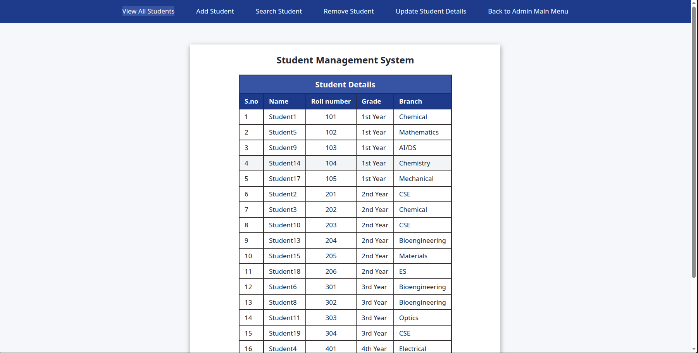
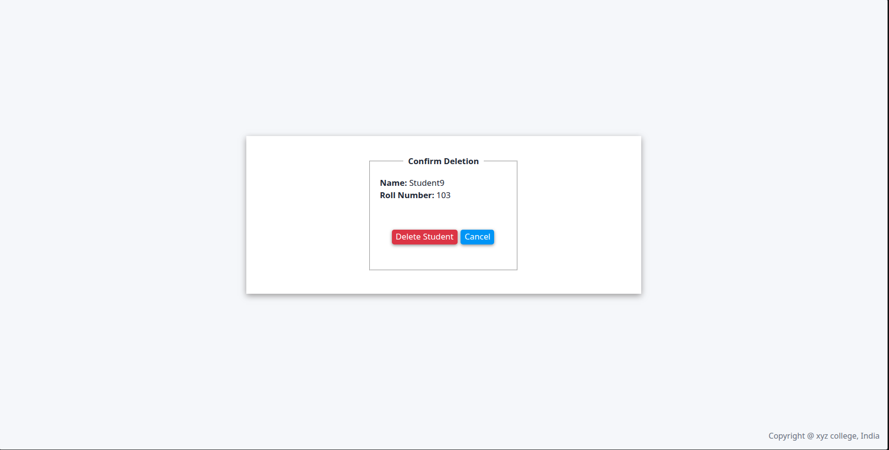

---

# Student Management System


A **Flask-based Student Management System** developed as a learning project to gain practical experience in backend development, database management, software architecture, and full-stack web development.

The application provides secure authentication, student and teacher management, persistent database storage, and a clean web interface built using Flask, SQLite, HTML, CSS, JavaScript, and Jinja2.

---

## Screenshots

### Home Page



### Admin Login



### Admin Menu



### Add Student



### Student Records



### Confirm-deletion Page



---

# Features

## Authentication

### Admin Authentication

* Secure admin login
* Session-based authentication
* Protected admin routes

### Teacher Authentication

* Teacher login using ID and password
* Session management
* Protected teacher dashboard

---

# Student Management

* Add Student
* View All Students
* Search Student
* Update Student Details
* Change Student Grade
* Change Student Branch
* Remove Student
* Automatic Roll Number Generation

---

# Teacher Management

* Add Teacher
* View All Teachers
* Search Teacher
* Update Teacher Details
* Change Subject
* Change Assigned Grades
* Remove Teacher
* Automatic Teacher ID Generation
* Automatic Password Generation

---

# User Interface

* Responsive Home Page
* Navigation Bar
* Flash Messages
* Styled Forms
* Styled Tables
* Reusable Components
* Logout Redirect Page
* Active Navigation Links

---

# Error Handling

* Custom 403 Forbidden Page
* Custom 404 Page Not Found
* Custom 500 Internal Server Error Page

---

# Database Features

* SQLite Database Integration
* Persistent Data Storage
* Automatic Database Initialization
* Automatic Admin Account Creation
* Parameterized SQL Queries

---

# Technologies Used

* Python 3
* Flask
* SQLite3
* HTML5
* CSS3
* JavaScript
* Jinja2
* Object-Oriented Programming (OOP)

---

# Project Structure

```text
student-management-system/
│
├── app.py
├── config.py
├── database.py
├── constants.py
│
├── blueprints/
│   ├── admin/
│   ├── students/
│   ├── teachers/
│   └── authentication/
│
├── models/
│
├── services/
│
├── templates/
│   ├── components/
│   ├── errors/
│   └── ...
│
├── static/
│   ├── style.css
│   ├── script.js
│   └── images/
│
├── student_management.db
│__ requirements.txt
└── README.md
```

---

# Concepts Practiced

* Flask Blueprints
* Jinja Template Inheritance
* Object-Oriented Programming
* Layered Architecture
* Separation of Concerns
* CRUD Operations
* SQLite Database Operations
* Session-Based Authentication
* HTML Forms
* CSS Flexbox
* JavaScript DOM Manipulation
* Flash Messages
* Error Handling

---

# Installation

## Clone the Repository

```bash
git clone <repository-url>
```

## Navigate to the Project

```bash
cd student-management-system
```

## Create a Virtual Environment

### Linux/macOS

```
python3 -m venv venv
```

```bash
source venv/bin/activate
```

### Windows

python -m venv venv

```bash
venv\Scripts\activate
```

## Install Dependencies

```bash
pip install -r requirements.txt
```

---

# Usage

Run the application:

### Windows

 python app.py

### &#x20;Linux/macOS 

python3 app.py

Open your browser and visit:

```text
http://127.0.0.1:5000
```

---

# Default Admin Credentials

```text
Username: admin
Password: admin123
```

---

# Future Improvements

* Password Reset
* Advanced Search & Filtering
* Pagination
* User Profile Management
* Logging System
* Unit Testing

---

# Learning Objectives

This project was developed to gain practical experience with:

* Flask Backend Development
* Full-Stack Web Development
* Database Management
* SQLite
* Software Architecture
* Object-Oriented Programming
* HTML, CSS and JavaScript
* Jinja2 Template Engine
* Authentication Systems

---

# Author

**Mohit Jingar**

B.Tech Electrical Engineering

Indian Institute of Technology Jodhpur

---

# Project Status

Completed as a learning project and actively maintained for future improvements.

---

# Version History

## v1.0

* Console-based Student Management System
* CSV File Storage
* Student CRUD
* Teacher CRUD
* Authentication

## v2.0

* Migrated to SQLite
* Improved Software Architecture
* Models and Services
* Persistent Database

## v3.0 (Current)

* Migrated to Flask Web Application
* Complete web-based interface
* SQLite integration
* HTML, CSS and JavaScript Frontend
* Flask Blueprints
* Jinja Template Inheritance
* Student & Teacher CRUD
* Session-Based Authentication
* Flash Messages
* Responsive Home Page
* Custom Error Pages
* Improved User Interface
* Reusable Jinja templates
* Modular Project Structure

## License

This project is developed for educational purposes.